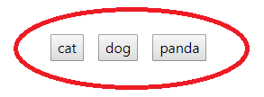

# Gifmaster

The Gifmaster application searches for gifs using the giphy api. The user can click on a term button to search, and add more terms using the provided form. Click a gif to start its animation. Hover over a gif to view its rating.

Gifmaster is deployed to github, and can be accessed by visiting https://gavinquirk.github.io/Gifmaster/

