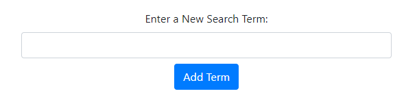
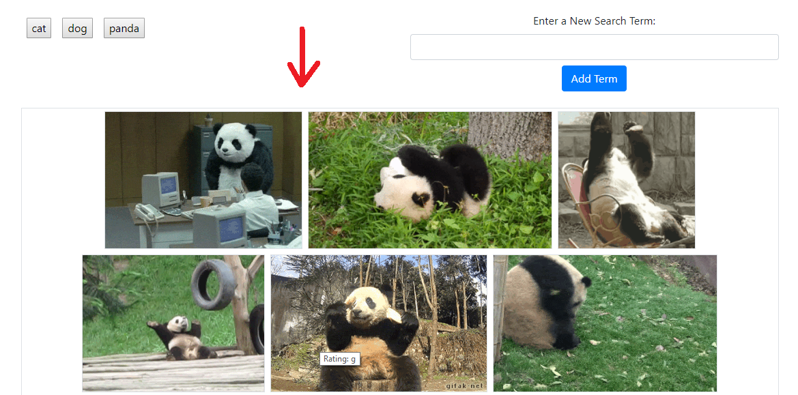

# Gifmaster

The Gifmaster application searches for gifs using the Giphy API. The user can click on a term button to search, and add more terms using the provided form. Click a gif to start its animation. Hover over a gif to view its rating.

Gifmaster is deployed to github, and can be accessed by visiting https://gavinquirk.github.io/Gifmaster/

Click on a term button to search for related gifs
 

Add a new search term by entering one into the form and pressing submit

After clicking a term button, gifs will populate into the box below.

Click on a gif to start and stop animation. Hover over a gif to see its rating.
